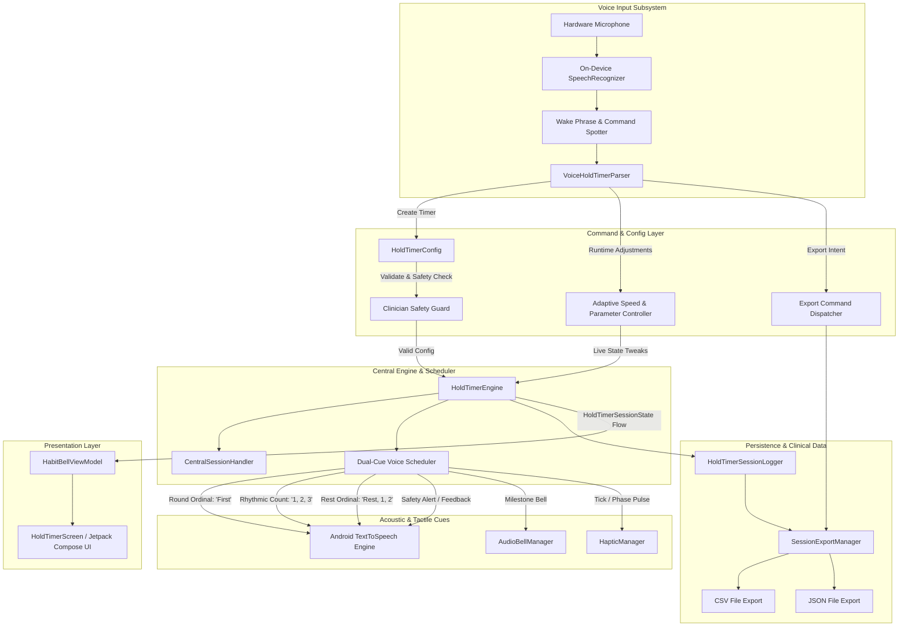

# 15. Voice-Driven Yoga / Physiotherapy Hold Timer Subsystem

The **Voice-Driven Yoga / Physiotherapy Hold Timer Subsystem** (`yoga-physio-hold-timer`) is a hands-free, voice-activated wellness timer engineered for isometric posture holds, physiotherapy rehabilitation intervals, and restorative breath retention cycles. The subsystem operates 100% offline on Android devices, combining on-device speech recognition, an extensible natural language grammar parser, a dual-cue audio scheduler (round-level announcements + count-aloud speech loops), dynamic in-session parameter adjustments, adaptive pacing feedback, clinician safety boundaries, and HIPAA/GDPR-compliant local session logging with CSV/JSON exports.

---

## 1. Architectural Topology & Component Diagram

---

## 2. Core Domain Components

| Component | Path | Architectural Role & Responsibilities |
| :--- | :--- | :--- |
| `HoldTimerConfig` | `com.habitbell.app.data.model.HoldTimerConfig` | Immutable configuration entity defining hold duration, rest duration, repeat count, ordinal round labels, clinician safety limit (`maxHoldSec`), TTS speed, and JSON serialization. |
| `HoldTimerSessionState` | `com.habitbell.app.holdtimer.HoldTimerSessionState` | Immutable reactive telemetry state (`phase`, `currentRound`, `currentSecond`, `ttsSpeed`, `safetyWarning`, `feedbackMessage`) emitted via `StateFlow`. |
| `VoiceHoldTimerParser` | `com.habitbell.app.holdtimer.VoiceHoldTimerParser` | Stateless Natural Language voice grammar parser converting spoken sentences into structured `VoiceHoldCommand` intents. |
| `HoldTimerEngine` | `com.habitbell.app.holdtimer.HoldTimerEngine` | Central countdown finite state machine and dual-cue scheduler running on Kotlin Coroutines with monotonic time drift compensation (`SystemClock.elapsedRealtime()`). |
| `HoldTimerVoiceListener` | `com.habitbell.app.holdtimer.HoldTimerVoiceListener` | Hands-free continuous speech listener wrapping Android's on-device `SpeechRecognizer` (`EXTRA_PREFER_OFFLINE = true`) and providing `SimulatedVoiceCommandSource` for unit testing. |
| `HoldTimerSessionLogger` | `com.habitbell.app.holdtimer.HoldTimerSessionLogger` | Local telemetry logger recording completed rounds and formatting offline CSV and JSON reports with Android `FileProvider` share intents. |
| `HoldTimerManager` | `com.habitbell.app.holdtimer.HoldTimerManager` | Authoritative domain coordinator bound to `CentralSessionHandler` alongside `BreathCountManager` and `MantraCountManager`. |
| `HoldTimerScreen` | `com.habitbell.app.ui.screens.HoldTimerScreen` | Dedicated Jetpack Compose presentation screen rendering countdown rings, round progress, safety alerts, speed chips, and export buttons. |

---

## 3. Dual-Cue Engine Audio Scheduling

The dual-cue engine coordinates two complementary acoustic feedback layers:

1. **Round-Level Cues**:
   - Spoken ordinals: *"First"*, *"Second"*, *"Third"*, ... articulated at the start of each round via Android `TextToSpeech` with a 1.2s preparation settling buffer.
   - Synchronous Tibetan singing bowl chime sounded via `AudioBellManager.playIntervalBell()`.

2. **Hold-Level Cues**:
   - Count-aloud second progression: *"one, two, three..."* matching the exact hold duration.
   - Monotonic time tracking: each tick calculates `remaining = (1000L / ttsSpeed) - elapsed` using `SystemClock.elapsedRealtime()`, preventing sleep drift.
   - Tactile micro-pulse: fires a crisp 25ms haptic pulse via `HapticManager.triggerStrokeHaptic()`.

3. **Rest-Level Cues**:
   - Recovery boundary cue: announces *"Rest"* and counts down rest seconds if `restDurationSec > 0` and the active round is not the final round.

---

## 4. In-Session Dynamic Adjustments & Adaptive Pacing

Practitioners can adjust the running timer without touching the device display:

- **Hold Duration Adjustments**:
  - Utterances: *"Set hold to 45 seconds"*, *"Change hold to 60"*
  - Behavior: Updates `activeConfig.holdDurationSec` and `HoldTimerSessionState.totalSecondsInPhase` immediately.
- **Repeat Count Adjustments**:
  - Utterances: *"Change repeats to 5"*, *"Set rounds to 6"*
  - Behavior: Updates total scheduled rounds on-the-fly.
- **Adaptive Speed Controller**:
  - Utterance: *"Too fast"* → Decreases speech and count rate by `-0.15f` (clamped to `[0.6f..1.8f]`).
  - Utterance: *"Too slow"* → Increases speech and count rate by `+0.15f` (clamped to `[0.6f..1.8f]`).
  - Utterances: *"Make the count faster"* / *"Count slower"*.

---

## 5. Clinician Safety Guard

To prevent musculoskeletal strain or over-exertion during rehabilitation or advanced asana holds:
- Every `HoldTimerConfig` enforces `maxHoldSec` (default 60s).
- If a user's spoken or configured hold duration exceeds `maxHoldSec`:
  - **Spoken Alert**: *"Warning: hold time exceeds the recommended limit of {maxHoldSec} seconds."*
  - **Visual Indicator**: Renders an ambient amber safety warning banner in `HoldTimerScreen`.
  - **State Guard**: Sets `HoldTimerSessionState.safetyWarning`.

---

## 6. Data Logging & Clinical Export

- **Offline Telemetry**: Each completed round logs `roundIndex`, `targetHoldSec`, `actualHoldSec`, `restSec`, `speedRating`, and `timestampMs`.
- **Spoken Trigger**: Utterances like *"Export session data"*, *"Export as CSV"*, or *"Export as JSON"*.
- **Formats**:
  - **CSV**: Standard comma-separated values compatible with EHR systems, Excel, and spreadsheet analytics.
  - **JSON**: Machine-readable payload for clinician dashboards and clinical trial repositories.
- **Android Share Sheet**: Uses Android `FileProvider` to dispatch an `Intent.ACTION_SEND` chooser without requiring external storage permissions.

---

## 7. Concurrency & Threading Invariants

- **Engine Execution**: Runs on `Dispatchers.Default` + `SupervisorJob`.
- **Telemetry Dispatches**: Emitted through Kotlin `StateFlow<HoldTimerSessionState>` and collected on the Main looper via Compose `collectAsState()`.
- **SpeechRecognizer Lifecycle**: Initialized on the Main looper per Android platform requirements.
- **Zero-Internet Invariant**: Operates entirely offline without requiring external network connectivity or cloud APIs.
